# Get Your Asana Mat

    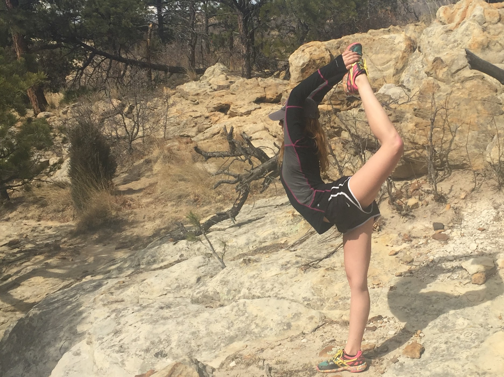

## Background and Motivation

Yoga has been a huge part of my life, it's something that grounds me and has made me a more patient person. I hope to become a Data Science Yoga Teacher and thought that a yoga pose classifier could be super useful for people learning yoge, who are not very familiar with pose names. The longterm goal for this project is to add in the whole range of Asanas, but will start with just 2 poses: mountain and downward dog.

## Data

The images I'm using for this project have been found on the internet, collected and shared by a reddit user, and the rest of the images I collected from a google image search, friends, and classmates. 

 - The downdog class has 234 images.
 - The mountain class has 232 images.

I created a pipeline to read in the URLs to the images, convert the images to greyscale, and resize to 43 pixels. 

Here is a sample of an original image, greyscale image, and a resized image from each class: 

______ insert reg, grey image, resized image here 

Since yoga is all about shapes, color should not affect the classification at all. Not only does greyscaling and resizing the data make the data smaller, but it makes it easier to work with. 

## EDA

Now that the data is grey and easy to work with, it's time for feature extraction! How can I train my model to set it up for success? 

In order to get a feel for the data and for how the models I plan to use would work, I decided to start with only two poses to work with: Downdog and Mountain.

The first thing I did was take a look at the mean pixel intensities for each of the first two classes. 

    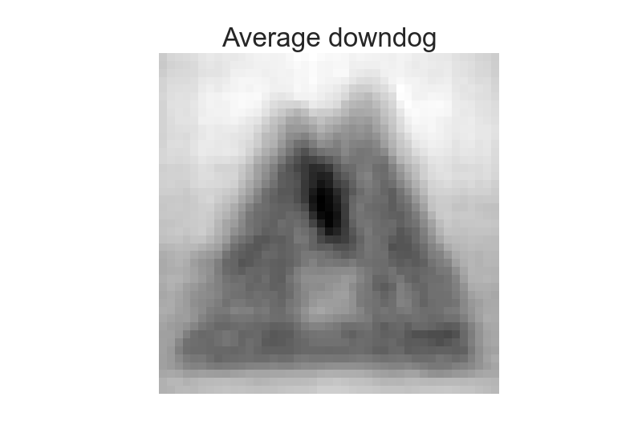
    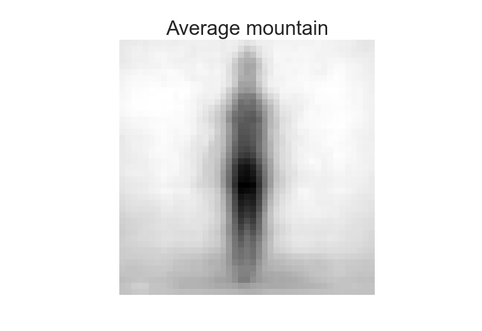 

The downdog image looks a bit like a two-humped camel, but the general shape seems pretty decent. Mountain pose makes me feel a little uneasy with the slight creepyness, but it seems very clear and will hopefully do well in the model. 

Next, I created histograms for the Frequency of the pixel intensities for each model. This shows how light and dark each image is, and how defined the shapes are. Interpreting pixel intensities: 0 is white and 255 is black. 

    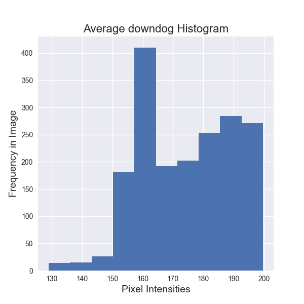
    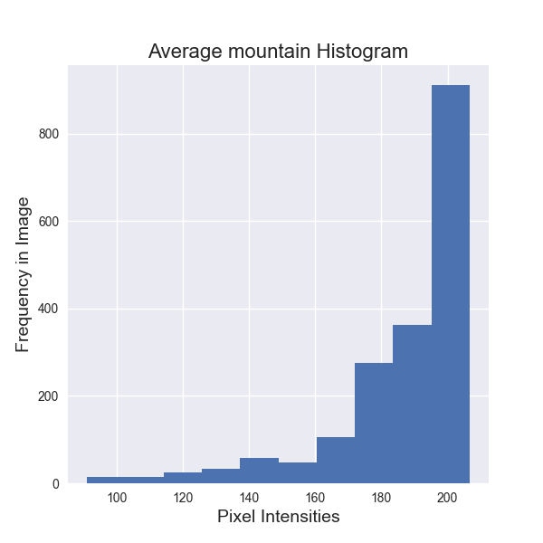 

The downdog histogram has a lot more grey area, which I expect will make it a bit harder to classify, especially when applied to more than just the mountain/downdog comparison. Mountain is well defined with the majority of the average image being dark pixel intensities which, I expect will do well in a model. I predict that there will be a lot more downdog images incorrectly classified based on these average images.

What about edge detection? Since we're working with shapes, maybe looking at the edges of each pose as a feature will do better in the model.

Let's take a look at the average image from each class again, but this time play around with a couple of different edge detection filters.

Sobel Filter:

    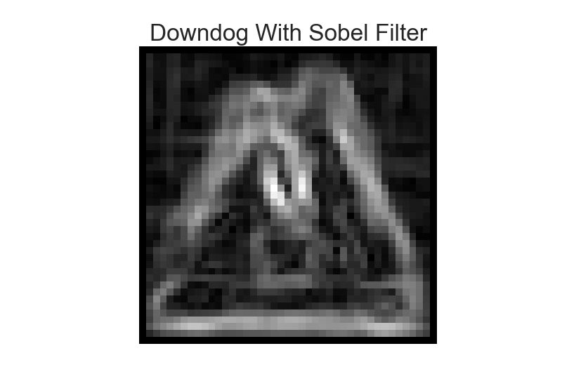
    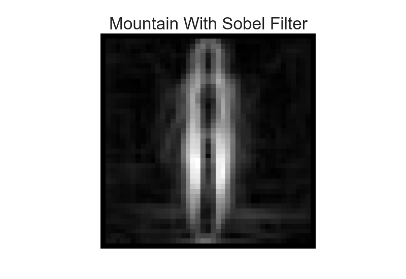 

Canny Filter: 

    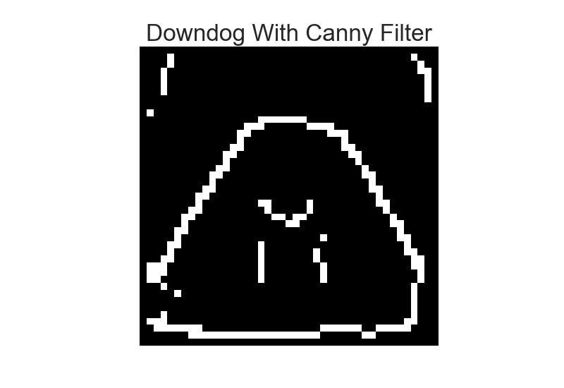
    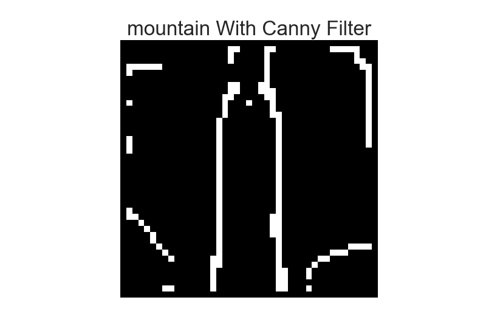 

## Principal Component Analysis

Based on the featurization above, I decided to use the Canny filter in my models since the images are so different from eachother. Between the Canny and Sobel, the Canny filter has much harsher lines, which could bode well for the model results.

Since images have so many features (these images are 43x43 pixels), I used Principal Component Analysis to consolidate the features and reduce dimensionality of the data. PCA takes all the features from your data and forces them into the number of features that you specify. It does this orthogonally.

I'm feeling incrediby confident in the difference between the two poses, so I'm going to try to reduce my data down to two and three features using PCA to compare the accuracy results of the models I will use later on. Here are the scatter plots: 

    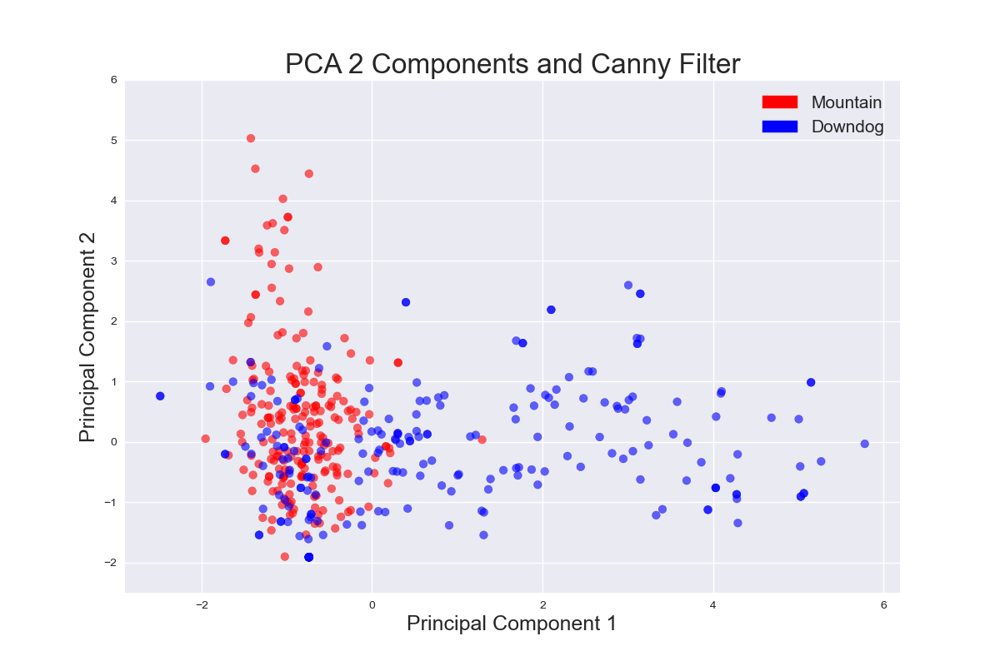
    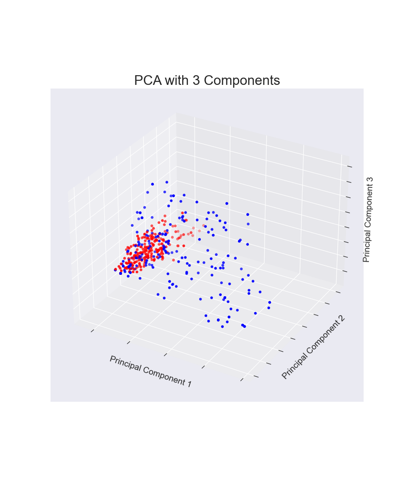 

A lot of the points in 2D look pretty separate, but there's a large section of overlap. 

In 3D, it looks like the poses separate a tiny bit more, but it's hard to tell if it's enough to improve the accuracy of the model. 

## Logistic Regression

I used k-folds cross validation with 5 folds and a probability threshold of 0.53 in order to be classified as Mountain Pose. I chose a 0.53 threshold after looking at an ROC curve and pulling out the threshold for the elbow of the plot. See the ROC curve below! 

During cross validation:
The 2 component PCA-vectorized data resulted in a training accuracy was 0.781 and a test accuracy was 0.771

The 3 component PCA-vectorized data resulted in a training accuracy of 0.772 and a test accuracy of 0.773.

Based on the cross validation scores, I decided to use the PCA with 3 feature data going forward. 
After running the Logistic Regression model on the test dataset, there were a few results: 

ROC Curve:

    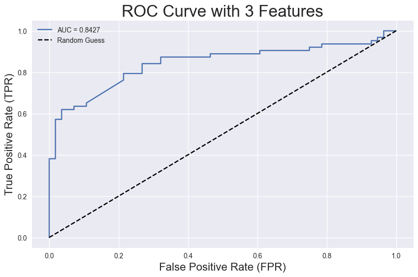 

Confusion Matrix:

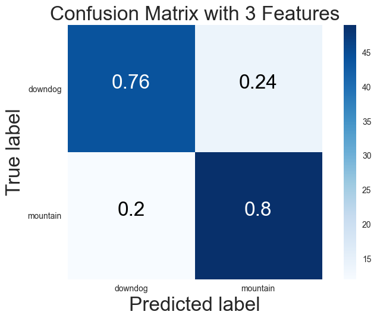

Overall this model comes up with a test accuracy of 0.8427! 

I'm pretty happy with the results but one thing I'd like to look at before moving on is what is going on in the pictures that have False Positives and False Negatives? 

Here are some pictures that were incorrectly classified as mountain pose:

    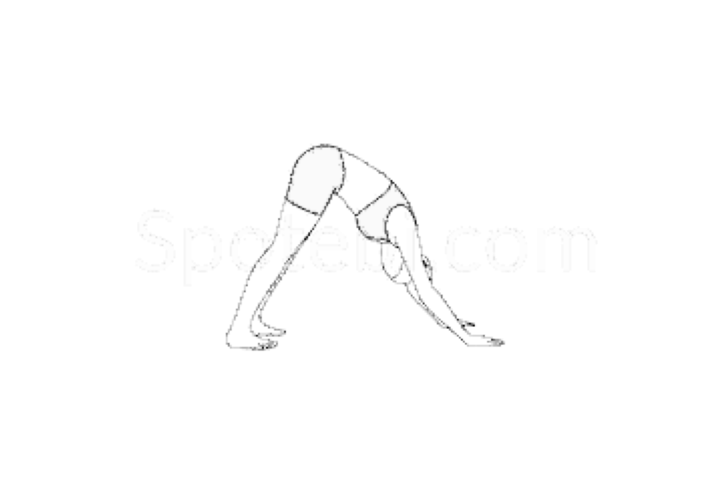 
    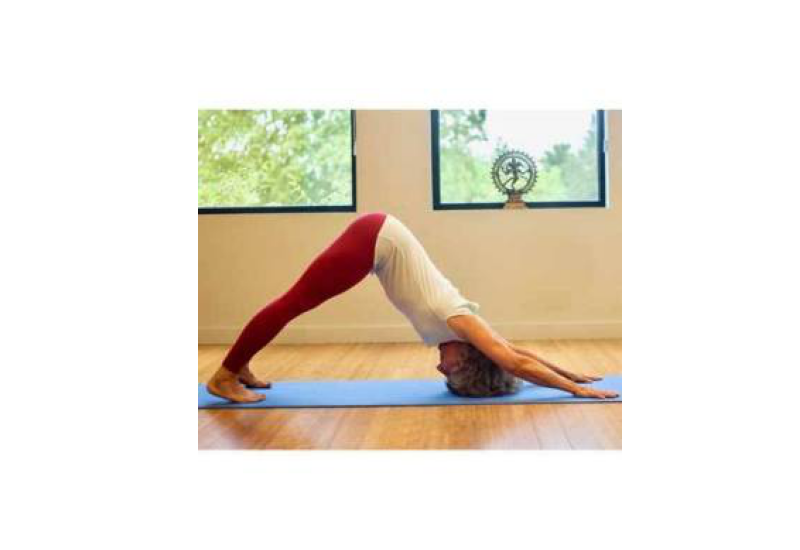 
    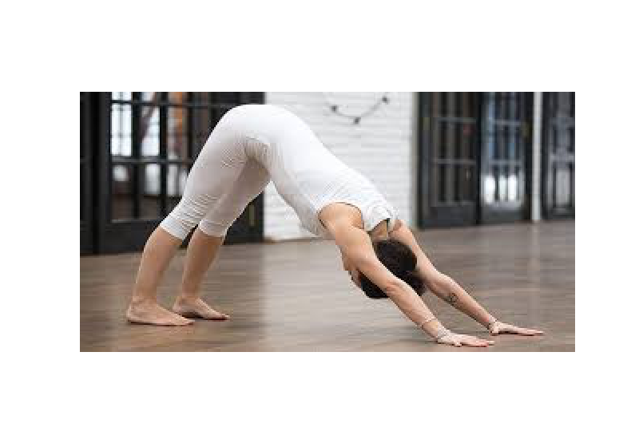 

Since we're using edge detection as a way to featurize the data, the reason the model produced these false positives could be due to the harsh illustration lines and the windows behind the yogis.

Here are some pictures that were incorrectly classified as downward dog: 

    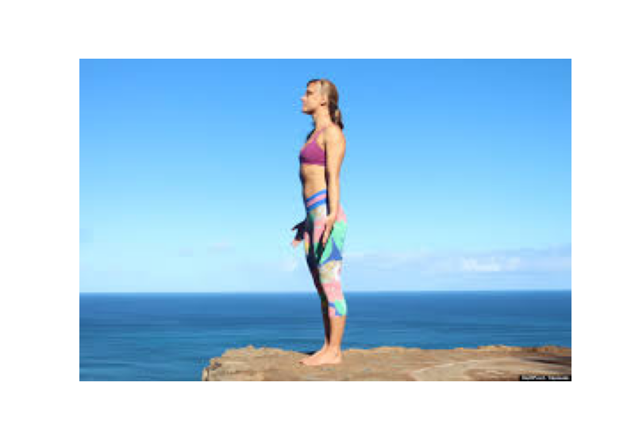 
    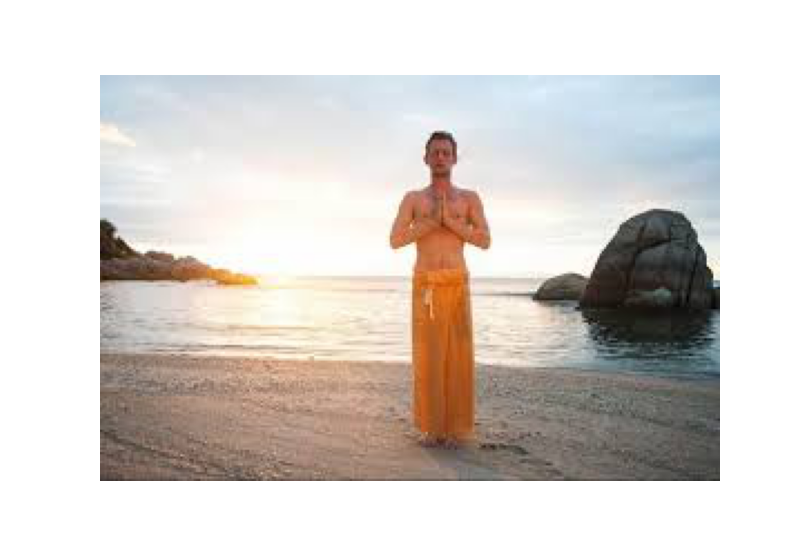 
    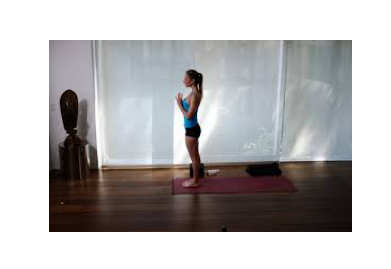 

The lighting or backgrounds could be cause for false negatives in these cases.

## Random Forest 

These results were decent for the classification of just two poses, but how can we be sure that the relationship between the images is linear? 

Let's try a Random Forest model!

