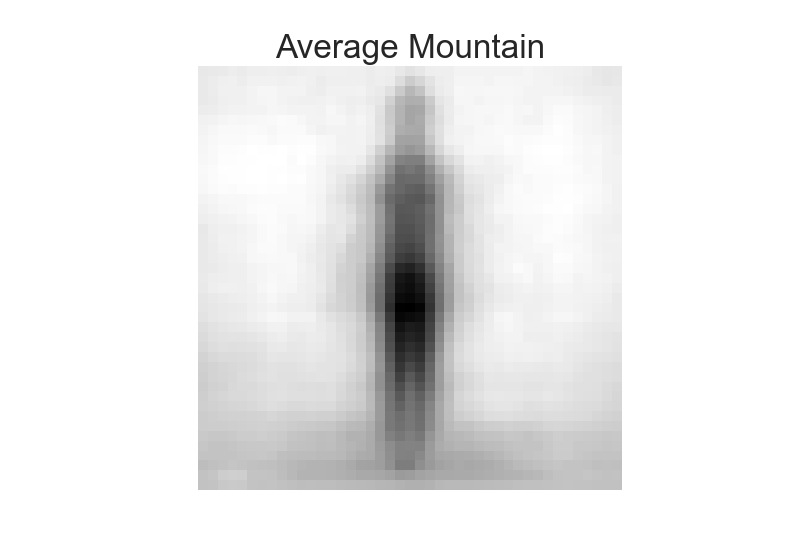
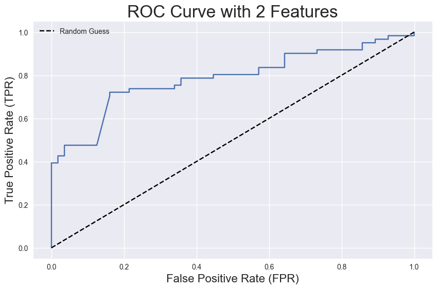
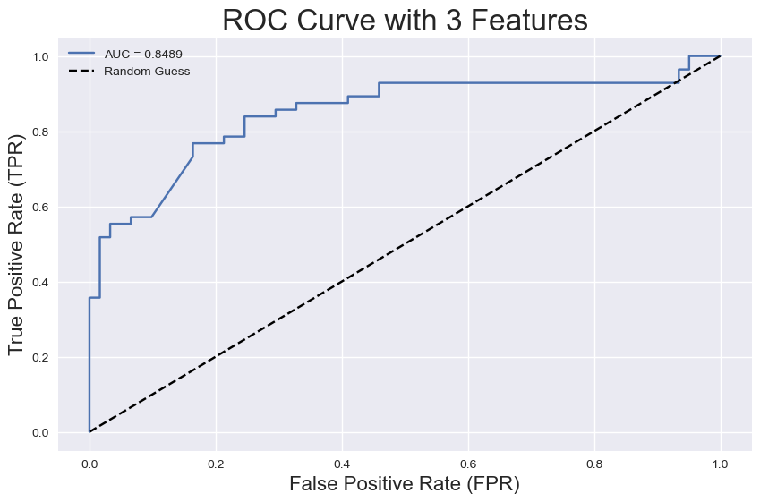
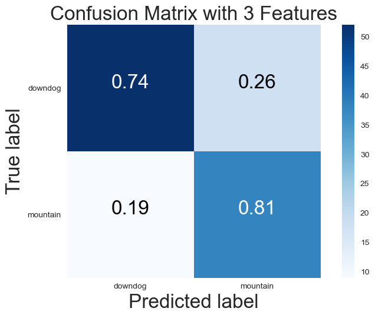

# Get Your Asana Mat

## Background and Motivation

Yoga has been a huge part of my life, it's something that grounds me and has made me a more patient person. When thinking about project ideas, I wanted to do something that applied to my life in some way. While I'm not usually wondering which pose I am doing, I thought it could be super useful for people learning yoga. 

## Data

The images I'm using for this project have been found on the internet, collected by a user: and shared on Reddit, and the rest of the images I collected from a google image search and from friends and classmates. 

 - The downdog class has 234 images.
 - The mountain class has 232 images.
 - The halfmoon class has __ images.

I created a pipeline to read in the URLs to the images, convert the images to greyscale, and resize to 43 pixels. 

Here is a sample of an original image, greyscale image, and a resized image from each class: 

______ insert reg, grey image, resized image here 

Since yoga is all about shapes, color should not affect the classification at all. Not only does greyscaling and resizing the data make the data smaller, but it makes it easier to work with as well. 

## EDA

Now that the data is grey and easy to work with, it's time for feature extraction! How can I train my model to set it up for success? 

In order to get a feel for the data and for how the models I plan to use would work, I decided to start with only two poses to work with: Downdog and Mountain.

The first thing I did was take a look at the mean pixel intensities for each of the first two classes. 

    
     

The downdog image looks a bit like a two-humped camel, but the general shape seems pretty decent. Mountain pose makes me feel a little uneasy with the slight creepyness, but it seems very clear and will hopefully do well in the model. 

Next, I created histograms for the Frequency of the pixel intensities for each model. This shows how light and dark each image is, and how defined the shapes are: 

    
     

The downdog histogram has a lot more grey area, which you can see in the pixel intensity graphs above, which I expect will make it a bit harder to classify when applied to more than just the mountain/downdog comparison. Mountain is well defined and dark which again, I expect will do well in a model. 

What about edge detection? Since we're working with shapes, maybe looking at the edges of each pose as a feature will do better in the model.

Sobel Filter:

    
     

Canny Filter: 

    
     

## Logistic Regression

Based on the featurization above, I decided to use the Canny filter in the Logistic Regression since the images were so different from eachother. 

Since images have so many features (these images are 43x43 pixels), I then used Principal Component Analysis to consolidate down to two features before cross validating. I also wanted to look at using 3 features to see how that would affect the model accuracy.

    
     

I used k-folds cross validation with 5 folds and a probability threshold of 0.75 in order to be classified as Mountain Pose. I chose a 0.75 threshold because mountain pose has a much more distinct image as seen in the mean image pixel intensity above.

During cross validation:
The 2 component PCA-vectorized data resulted in a training accuracy was 0.711 and a test accuracy was 0.710

The 3 component PCA-vectorized data resulted in a training accuracy of 0.737 and a test accuracy of 0.742.

ROC Curves with 2 and 3 features:

    
     

Confusion Matrix with 3 features:

