# Get Your Asana Mat

    

## Background and Motivation

Yoga has been a huge part of my life, it's something that grounds me and has made me a more patient person. I hope to become a yoga teacher one day, and thought that a yoga pose classifier could be super useful for people learning yoga, who are not very familiar with pose names. The goal for this project is to add in the whole range of asanas, but will start with just 2 poses: mountain and downward dog to understand featurization, and slowly build up the models and pose range. 

    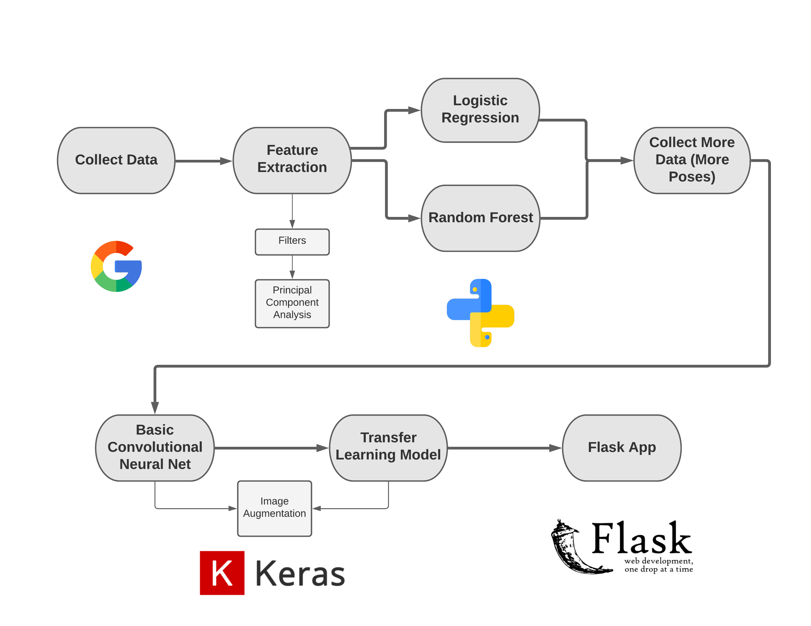

## Data

The images I'm using for this project have been found on the internet from a google search, and the rest of the images I collected from friends and classmates. 

 - The downdog class has 240 images.
 - The mountain class has 240 images.

I created a pipeline to read in the URLs to the images, convert the images to greyscale, and resize to 43 pixels. 

Here is a sample of a few images included in my dataset: 

    
    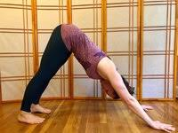 
    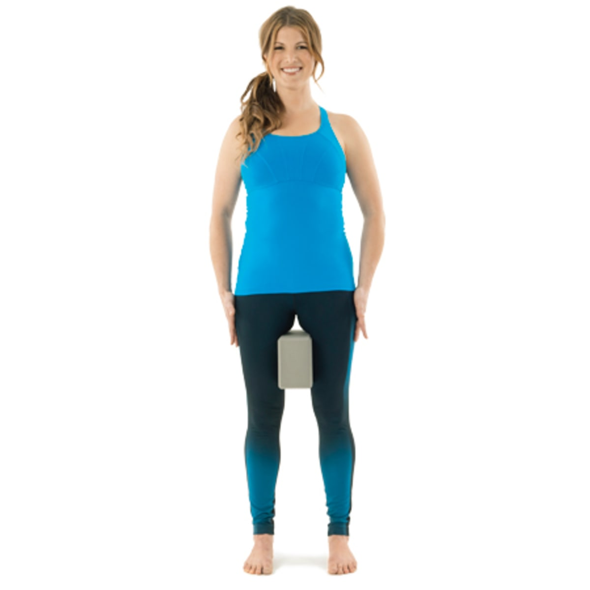 
    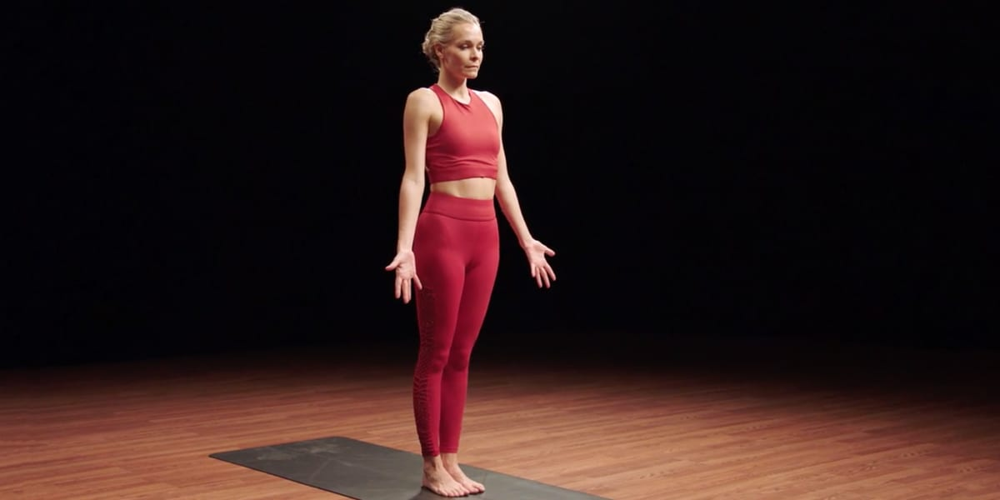 

Since yoga is all about shapes, color should not affect the classification at all. Not only does greyscaling and resizing the data make the data smaller, but it makes it easier to work with. 

## EDA

Now that the data is grey and easy to work with, it's time for feature extraction! How can I train my model to set it up for success? 

In order to get a feel for the data and for how the models I plan to use would work, I decided to start with only two poses to work with: Downdog and Mountain.

The first thing I did was take a look at the mean pixel intensities for each of the first two classes. 

    
     

The downdog image looks a bit like a two-humped camel, but the general shape seems pretty decent. Mountain pose makes me feel a little uneasy with the eerie outline, but it seems very clear and will hopefully do well in the model. 

Next, I created histograms for the Frequency of the pixel intensities for each model. This shows how light and dark each image is, and how defined the shapes are. Interpreting pixel intensities: 0 is white and 255 is black. 

    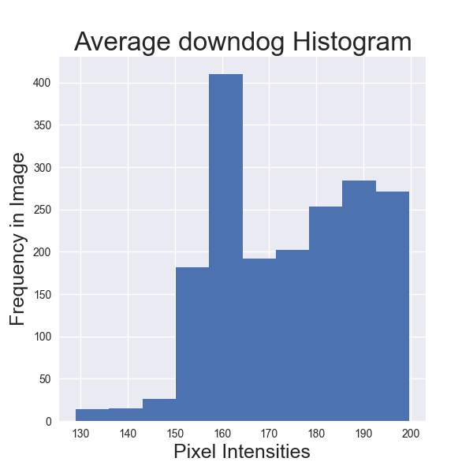
    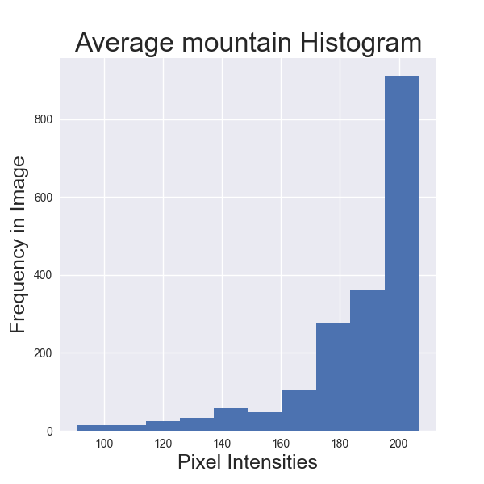 

The downdog histogram has a lot more grey area, which I expect will make it a bit harder to classify, especially when applied to more than just the mountain/downdog comparison. Mountain is well defined with the majority of the average image being dark pixel intensities which, I expect will do well in a model. I predict that there will be a lot more downdog images incorrectly classified based on these average images.

What about edge detection? Since we're working with shapes, maybe looking at the edges of each pose as a feature will do better in the model.

Let's take a look at the average image from each class again, but this time play around with a couple of different edge detection filters.

Sobel Filter:

    
     

Canny Filter: 

    
     

Based on the featurization above, I decided to use the Canny filter in my models since the images are so different from eachother. Between the Canny and Sobel, the Canny filter has much harsher lines, which could bode well for the model results.

## Principal Component Analysis

Since images have so many features (these images are 43x43 pixels = 1849 features!), I used Principal Component Analysis to consolidate the features and reduce dimensionality of the data. PCA takes all the features from your data and forces them into the number of features that you specify. It does this orthogonally.

I'm feeling incrediby confident in the difference between the two poses, so I'm going to try to reduce my data down to two and three features using PCA to compare the accuracy results of the models I will use later on. Here are the scatter plots: 

    
    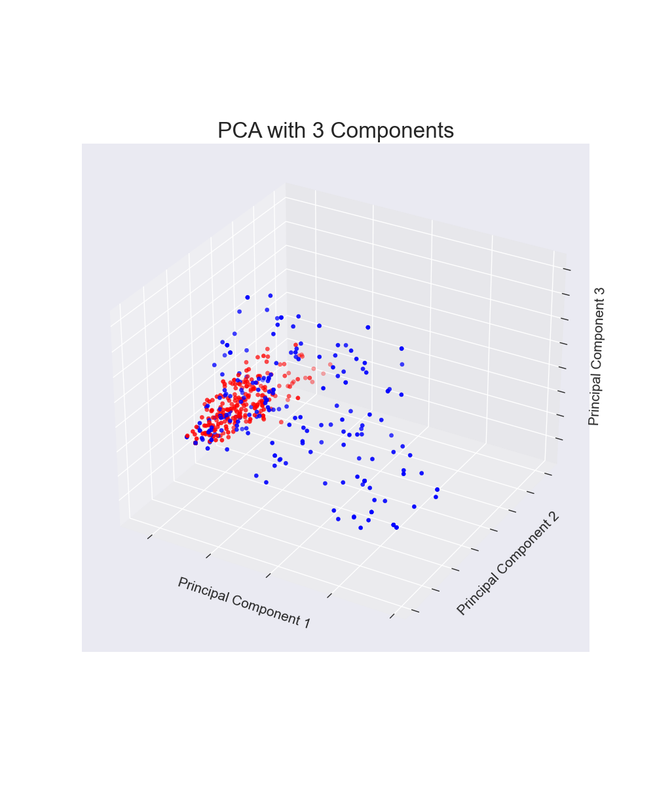 

A lot of the points in 2D look pretty separate, but there's a large section of overlap. 

In 3D, it looks like the poses separate a tiny bit more, but it's hard to tell if it's enough to improve the accuracy of the model. 

I decided to figure out the ideal number of PCA components as well, and decided to do this using a Scree Plot: 

    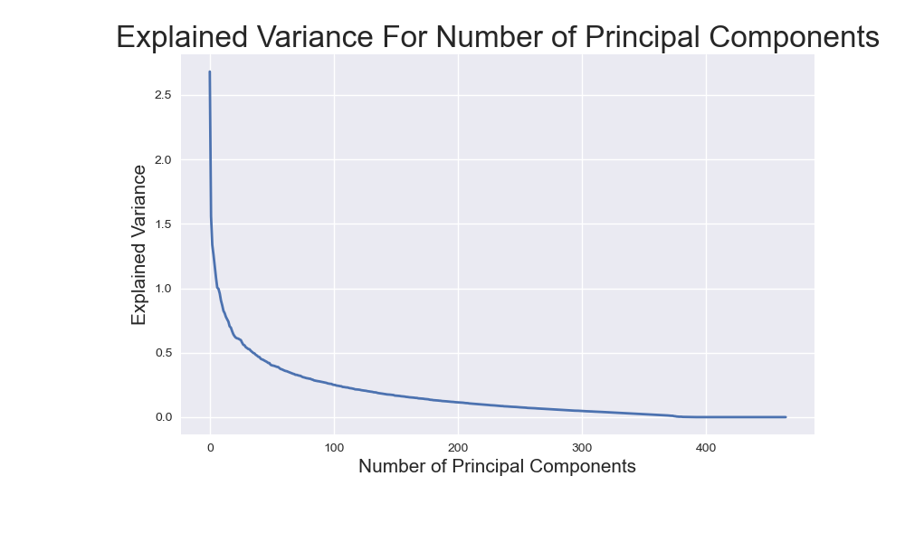 

Turns out 3 components is actually the ideal number of components, so I decided to use 3 going forward.

## Logistic Regression

I used k-folds cross validation with 5 folds and a probability threshold of 0.53 in order to be classified as Mountain Pose. I chose a 0.53 threshold after looking at an ROC curve and pulling out the threshold for the elbow of the plot. See the ROC curve below! 

During cross validation:

The 3 component PCA-vectorized data resulted in a training accuracy of 0.772 and a test accuracy of 0.773.

After running the Logistic Regression model on the test dataset, there were a few results: 

ROC Curve:

     

Confusion Matrix:

Overall this model comes up with a test accuracy of 0.782! 

I am pretty happy with the results but one thing I would like to look at before moving on is what is going on in the pictures that have False Positives and False Negatives? Is it apparent what is throwing off the model? 

Here are some pictures that were incorrectly classified as mountain pose in both the original image, and with the Canny filter:

     
     
     

Since we're using edge detection as a way to featurize the data, the reason the model produced these false positives could be due to the harsh illustration lines and the windows behind the yogis.

Here are some pictures that were incorrectly classified as downward dog as well as their Canny filter images: 

     
     
     

The lighting or backgrounds could be cause for false negatives in these cases. What do you think? 

## Random Forest 

These results were decent for the classification of just two poses, but how can we be sure that the relationship between the images is linear? 

Let's try a Random Forest model!

Since the PCA with 3 features produced the best results in the Logistic Regression, again I used this (on top of the canny filter) in the Random Forest model. 

A Random Forest is an ensemble method that combines multiple, weak learning decision trees to create one strong learner. It does this by randomly selecting a number of features to consider for each split. This ensures that the trees that make up the forest are more independent of one another than single trees. They don't train on all the same data or features which makes them more generalizable. 

Random Forests have a few different hyper-parameters, and in order to choose the best ones, I ran a RandomizedCV search with a many different options. The result included the following: 
 - n_estimators = 10
 - min_samples_split = 4
 - min_samples_leaf = 1
 - max_features = log2
 - max_depth = 5
 - bootstrap = True

Using the same method of cross-validation as Logistic Regression (5-folds with a threshold of 0.4), the training accuracy was 0.856 and the test accuracy was 0.664. This initially looks like the model is overfitting to the training data.

After running the model, here is the ROC curve and confusion matrix:

    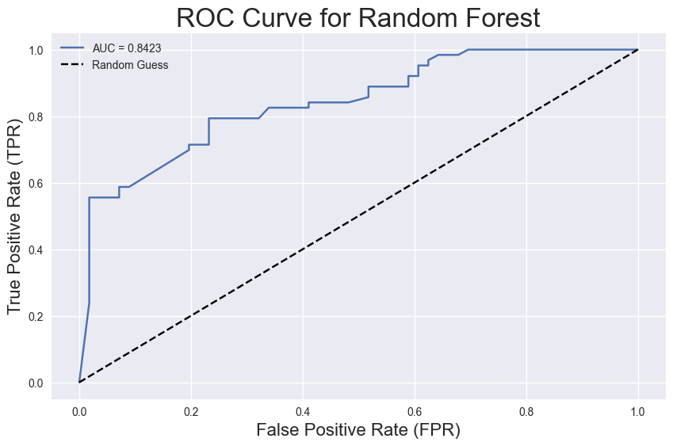 
    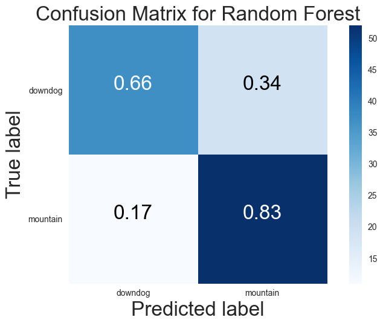 

The accuracy on the holdout data was 0.765!

Here are some pictures that were incorrectly classified as mountain pose:

    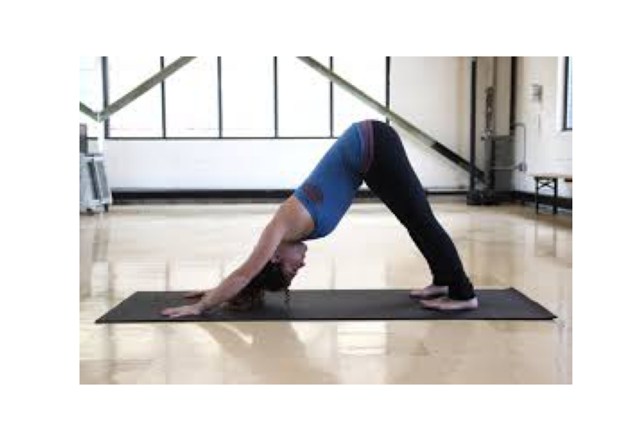 
    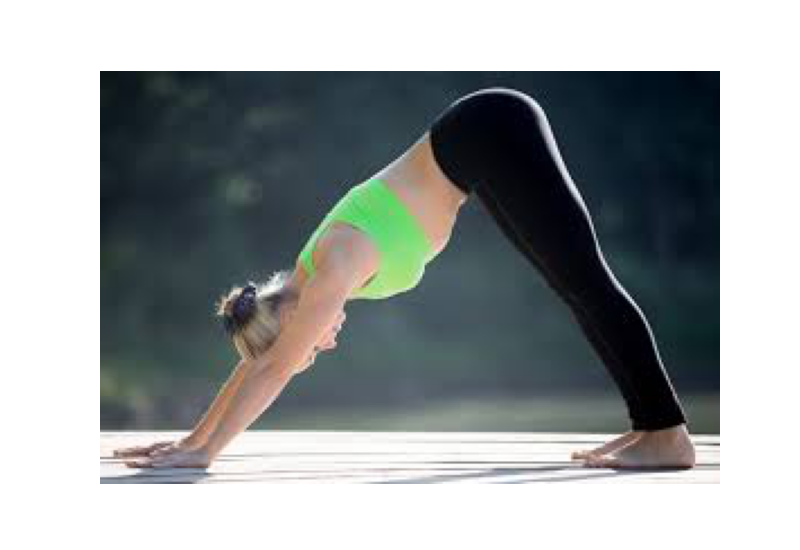 
     

Since we're using edge detection as a way to featurize the data, the reason the model produced these false positives could be due to the harsh illustration lines and the windows behind the yogis.

Here are some pictures that were incorrectly classified as downward dog: 

    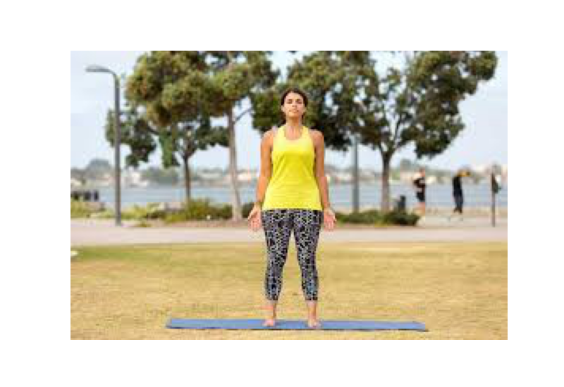 
    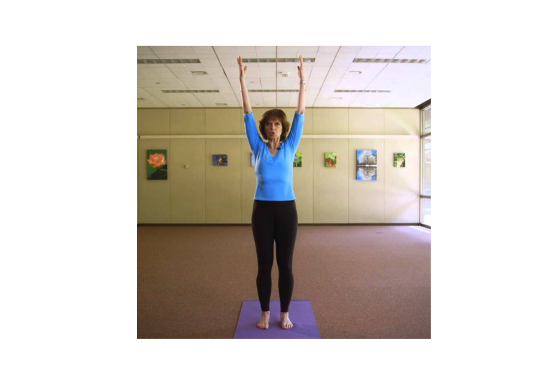 
    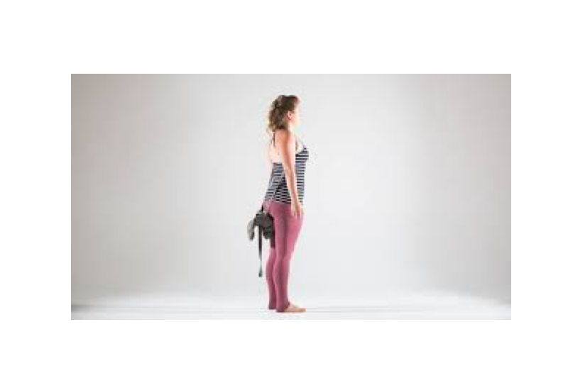 

## Adding Complexity - Basic Convolutional Neural Net

The next thing I'd like to do is use a Convolutional Neural Net (CNN) on the data, and start to incorporate more poses. How many poses can I add before the accuracy gets down to random chance? 

I decided to increase the number of poses to just 4 - adding Cow pose and Half Moon pose. I added the same number of images as Downdog and Mountain in order to maintain balanced classes. 

Turns out using a basic CNN model with only a couple of layers, the model accuracy was 25% which is random chance. This was even after using various image augmentations to increase the training set size.

My next trial was to apply a Transfer Learning model which would hopefully improve the accuracy of the model. I used an Xception model which had been trained on ImageNet and this improved the accuracy of the 4 poses to 88.5% - the best performing model overall! 

## Creating a Flask App

I used my best model - the Xception model - and created a simple Flask app for users to classify their own uploaded yoga pose pictures. 

Here are some screenshots of the steps of the app: 

## Future work

In the future, I would like to expand the number of poses as well as try some other transfer learning models to see how they would improve the accuracy of the pose classification. 

## Credits

A special thanks to Frank Burkholder, Kayla Thomas, Chris Reger, Sam Silver, and Michael Dyer for their help and direction through this project. 

Link to Google Slides presentation: https://docs.google.com/presentation/d/1z1LmAchpCE3Jjwi3VnDqC0R2fjTf-Dcsl-7nSEHNC7o/edit#slide=id.p 